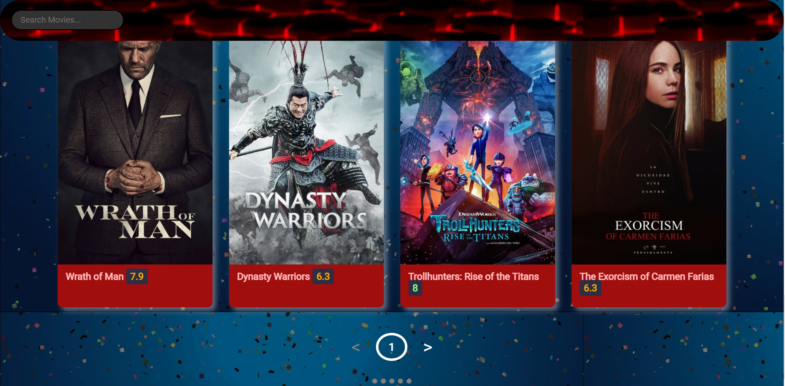

    
    
# Asci Project 1 : Movie Search Web Application
A Movie Search Web Application with different filters such as genre , type of shows and language.

## Team members
 - Swapnil Gite https://github.com/SwapnilGite
 - Mohan Mali https://github.com/MVMali

## Color Reference
   colorhunt.co

## Technologies used
- Language => HTML , CSS , Javascript
- Code editors => Sublime Text , Visual Studio Code
- Chrome DevTools
- API used => tmdb api
#### Get movies by genre

```http
  GET /genre/list
```

| Parameter | Type     | Description                |
| :-------- | :------- | :------------------------- |
| `Genre` | `string` |Required-Api_key|


#### Get trending movies/tv by week

```http
  GET /trending/Movie/week
  GET /trending/tv/week
  
```

| Parameter | Type     | Description                       |
| :-------- | :------- | :-------------------------------- |
| `time_window`      | `string` |Required-Api_key  |

## Other References
    https://www.w3schools.com/
    https://developer.mozilla.org/
 
## Features
   - Search for a movie by typing name in the Search Box.
   - See trending movies/tv shows by clicking on specific trending buttons.
   - Hover/click on movie poster to read overview of the movie.
   - Ratings of movie/tv shows are differentiated using proper colors.
   
## Screenshots
- Home Page(top)

- Home Page(bottom)

- Search results


  
